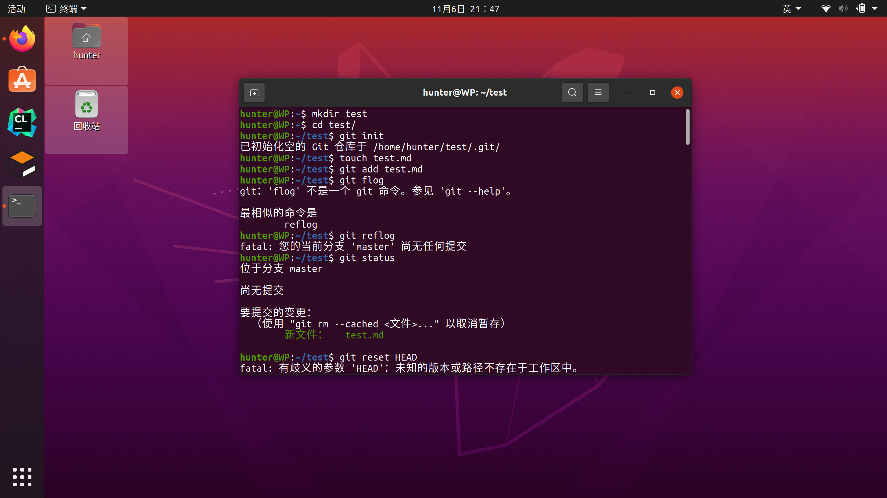
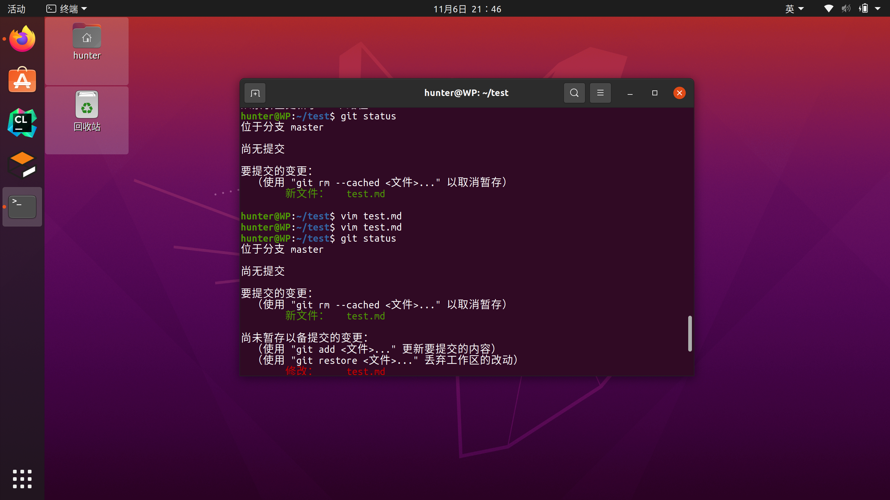
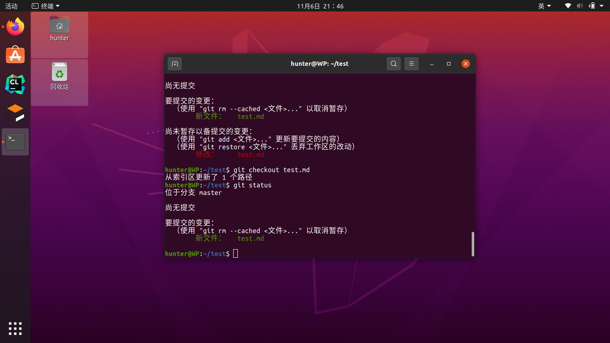
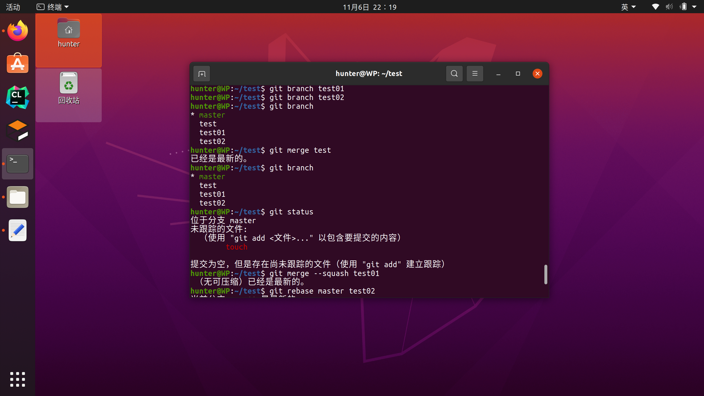

# 问题一：若你已经修改了部分文件......

* 法一： 可以使用 **git reset --hard**

* 法二：可以使用 **git checkout <文件名>**

# 问题二：若你已经提交了一个新版本......

* 法一：可以使用 **git reset --hard HEAD <版本>** 回退到一个版本，修改内容不保留

* 法二：可以使用 **git reset HEAD <版本>**回退到一个版本，但修改内容保留

# 问题三：我们已经知道了合并分支......

* (本手)：可以使用 **git merge**

* 法一： 可以使用 **git merge --squash**

  这样可以将另一个branch的代码移动到master上，再提交master,从而达到合并分支的效果

* 法二：可以使用 **git rebase <master> <branch>** 
  等同于 **git checkout <branch>** + **git rebase <master>**
  

